```mermaid
classDiagram
    direction TB

    %% === Main & Controller Layer ===
    class InventorySystem {
        <<Facade>>
        - totalMoney: double
        - collectionManager: CollectionManager
        - binderManager: BinderManager
        - deckManager: DeckManager
        + InventorySystem()
        + run(): void
        + getTotalMoney(): double
        + sellCardFromCollection(cardName: String): boolean
        + createBinder(name: String, type: String): boolean
        + deleteBinder(name: String): boolean
        + sellBinder(binderName: String): boolean
        + getBinders(): ArrayList<Binder>
        + findBinder(name: String): Binder
        + addCardToBinder(cardName: String, binderName: String): int
        + removeCardFromBinder(cardIndex: int, binderName: String): boolean
        + performTrade(binderName: String, cardIndex: int, incomingCard: Card): boolean
        + createDeck(name: String, type: String): boolean
        + deleteDeck(name: String): boolean
        + sellDeck(deckName: String): boolean
        + getDecks(): ArrayList<Deck>
        + findDeck(name: String): Deck
        + getCardTypes(): ArrayList<Card>
        + findCard(name: String): Card
        + getCardCounts(): HashMap<String, Integer>
        + increaseCardCount(name: String, amount: int): boolean
        + decreaseCardCount(name: String, amount: int): boolean
    }

    %% === Backend Layer (com.tcis.backend) ===
    class CollectionManager {
        - cardTypes: ArrayList<Card>
        - cardCounts: HashMap<String, Integer>
        + CollectionManager()
        + findCard(name: String): Card
        + addNewCard(name: String, baseValue: double, rarity: Rarity, variant: Variant): boolean
        + increaseCount(name: String, amount: int): boolean
        + decreaseCount(name: String, amount: int): boolean
        + isCardAvailable(name: String): boolean
        + getCardTypes(): ArrayList<Card>
        + getCardCounts(): HashMap<String, Integer>
        + sellCard(cardName: String): boolean
    }
    class BinderManager {
        - binders: ArrayList<Binder>
        - collectionManager: CollectionManager
        + BinderManager(cm: CollectionManager)
        + findBinder(name: String): Binder
        + createBinder(name: String, type: String): boolean
        + deleteBinder(name: String): boolean
        + sellBinder(name: String): double
        + addCardToBinder(cardName: String, binderName: String): int
        + removeCardFromBinder(cardIndex: int, binderName: String): boolean
        + performTrade(binderName: String, cardIndex: int, incomingCard: Card): boolean
        + getBinders(): ArrayList<Binder>
    }
    class DeckManager {
        - decks: ArrayList<Deck>
        - collectionManager: CollectionManager
        + DeckManager(cm: CollectionManager)
        + findDeck(name: String): Deck
        + createDeck(name: String, type: String): boolean
        + deleteDeck(name: String): boolean
        + sellDeck(name: String): double
        + addCardToDeck(cardName: String, deckName: String): int
        + removeCardFromDeck(cardIndex: int, deckName: String): boolean
        + getDecks(): ArrayList<Deck>
    }
    InventorySystem *-- CollectionManager : has [1]
    InventorySystem *-- BinderManager : has [1]
    InventorySystem *-- DeckManager : has [1]
    BinderManager ..> CollectionManager : uses [1]
    DeckManager ..> CollectionManager : uses [1]

    %% === GUI Layer (com.tcis.gui) ===
    class MainFrame {
        - inventory: InventorySystem
        - totalMoneyLabel: JLabel
        - manageCollectionBtn: JButton
        - manageBindersBtn: JButton
        - manageDecksBtn: JButton
        + MainFrame(inventory: InventorySystem)
        + updateTotalMoneyLabel(): void
    }
    class CollectionDialog {
        - inventory: InventorySystem
        - mainFrame: MainFrame
        - cardList: JList
        - cardListModel: DefaultListModel
        - addCardBtn: JButton
        - sellCardBtn: JButton
        - updateCountBtn: JButton
        + CollectionDialog(parent: Frame, inventory: InventorySystem)
        - refreshCardList(): void
    }
    class BinderDialog {
        - inventory: InventorySystem
        - mainFrame: MainFrame
        - binderList: JList
        - binderListModel: DefaultListModel
        - createBtn: JButton
        - viewBtn: JButton
        - sellBtn: JButton
        - deleteBtn: JButton
        + BinderDialog(parent: Frame, inventory: InventorySystem)
        - refreshBinderList(): void
        - updateButtonStates(): void
    }
    class DeckDialog {
        - inventory: InventorySystem
        - mainFrame: MainFrame
        - deckList: JList
        - deckListModel: DefaultListModel
        - createBtn: JButton
        - viewBtn: JButton
        - sellBtn: JButton
        - deleteBtn: JButton
        + DeckDialog(parent: Frame, inventory: InventorySystem)
        - refreshDeckList(): void
        - updateButtonStates(): void
    }
    class AddCardDialog {
        - inventory: InventorySystem
        - nameField: JTextField
        - valueField: JTextField
        - rarityComboBox: JComboBox
        - variantComboBox: JComboBox
        - addBtn: JButton
        - cancelBtn: JButton
        + AddCardDialog(parent: Dialog, inventory: InventorySystem)
    }
    class CreateBinderDialog {
        - inventory: InventorySystem
        - nameField: JTextField
        - typeComboBox: JComboBox
        + CreateBinderDialog(parent: Dialog, inventory: InventorySystem)
    }
    class CreateDeckDialog {
        - inventory: InventorySystem
        - nameField: JTextField
        - typeComboBox: JComboBox
        + CreateDeckDialog(parent: Dialog, inventory: InventorySystem)
    }
    class BinderContentsDialog {
        - binder: Binder
        - inventory: InventorySystem
        - cardListModel: DefaultListModel
        - addCardBtn: JButton
        - removeCardBtn: JButton
        - tradeBtn: JButton
        - setPriceBtn: JButton
        + BinderContentsDialog(parent: Dialog, inventory: InventorySystem, binderName: String)
        - refreshContentsList(): void
        - updateButtonStates(): void
    }
    class DeckContentsDialog {
        - deck: Deck
        - inventory: InventorySystem
        - cardListModel: DefaultListModel
        + DeckContentsDialog(parent: Dialog, inventory: InventorySystem, deckName: String)
        - refreshContentsList(): void
    }
    class SetPriceDialog {
        - luxuryBinder: LuxuryBinder
        + SetPriceDialog(parent: Dialog, binder: LuxuryBinder)
    }
    class TradeDialog {
        - inventory: InventorySystem
        - binder: Binder
        - outgoingCardIndex: int
        + TradeDialog(parent: Dialog, inventory: InventorySystem, binder: Binder, outgoingCardIndex: int)
    }

    MainFrame --o CollectionDialog : opens [1]
    MainFrame --o BinderDialog : opens [1]
    MainFrame --o DeckDialog : opens [1]
    CollectionDialog --o AddCardDialog : opens [1]
    BinderDialog --o CreateBinderDialog : opens [1]
    BinderDialog --o BinderContentsDialog : opens [1]
    DeckDialog --o CreateDeckDialog : opens [1]
    DeckDialog --o DeckContentsDialog : opens [1]
    BinderContentsDialog --o TradeDialog : opens [1]
    BinderContentsDialog --o SetPriceDialog : opens [1]

    MainFrame ..> InventorySystem : uses [1]

    %% === Models Layer (com.tcis.models) ===
    class Card {
        - name: String
        - baseValue: double
        - rarity: Rarity
        - variant: Variant
        + Card(name: String, baseValue: double, rarity: Rarity, variant: Variant)
        + getName(): String
        + getBaseValue(): double
        + getRarity(): Rarity
        + getVariant(): Variant
        + getCalculatedValue(): double
    }
    class Rarity {
        + COMMON
        + UNCOMMON
        + RARE
        + LEGENDARY
        + getDisplayName(): String
        + fromString(text: String): Rarity
    }
    class Variant {
        + NORMAL
        + EXTENDED_ART
        + FULL_ART
        + ALT_ART
        + getDisplayName(): String
        + getMultiplier(): double
        + fromString(text: String): Variant
    }
    Card *-- Rarity : has [1]
    Card *-- Variant : has [1]

    class Deck {
        <<Abstract>>
        + MAX_CAPACITY: int
        # name: String
        # cards: ArrayList<Card>
        + Deck(name: String)
        + getName(): String
        + getCards(): ArrayList<Card>
        + getCardCount(): int
        + addCard(card: Card): boolean
        + isFull(): boolean
        + containsCard(cardName: String): boolean
        + isSellable(): boolean
    }
    class NormalDeck {
        + NormalDeck(name: String)
        + isSellable(): boolean
    }
    class SellableDeck {
        + SellableDeck(name: String)
        + isSellable(): boolean
    }
    Deck <|-- NormalDeck
    Deck <|-- SellableDeck

    class Binder {
        <<Abstract>>
        + MAX_CAPACITY: int
        # name: String
        # cards: ArrayList<Card>
        + Binder(name: String)
        + getName(): String
        + getCards(): ArrayList<Card>
        + getCardCount(): int
        + addCard(card: Card): boolean
        + isFull(): boolean
        + canAddCard(card: Card): boolean
        + isSellable(): boolean
        + canTrade(): boolean
        + calculatePrice(): double
    }
    class NonCuratedBinder {
        + NonCuratedBinder(name: String)
        + canAddCard(card: Card): boolean
        + isSellable(): boolean
        + canTrade(): boolean
        + calculatePrice(): double
    }
    class CollectorBinder {
        + CollectorBinder(name: String)
        + canAddCard(card: Card): boolean
        + isSellable(): boolean
        + canTrade(): boolean
        + calculatePrice(): double
    }
    class SellableBinder {
        <<Abstract>>
        + SellableBinder(name: String)
        + isSellable(): boolean
        + canTrade(): boolean
    }
    class PauperBinder {
        + PauperBinder(name: String)
        + canAddCard(card: Card): boolean
        + calculatePrice(): double
    }
    class RaresBinder {
        + RaresBinder(name: String)
        + canAddCard(card: Card): boolean
        + calculatePrice(): double
    }
    class LuxuryBinder {
        - customPrice: double
        + LuxuryBinder(name: String)
        + canAddCard(card: Card): boolean
        + calculatePrice(): double
        + setPrice(price: double): boolean
    }
    Binder <|-- NonCuratedBinder
    Binder <|-- CollectorBinder
    Binder <|-- SellableBinder
    SellableBinder <|-- PauperBinder
    SellableBinder <|-- RaresBinder
    SellableBinder <|-- LuxuryBinder

    CollectionManager o-- Card : manages [*]
    BinderManager o-- Binder : manages [*]
    DeckManager o-- Deck : manages [*]
    Binder o-- Card : contains [*]
    Deck o-- Card : contains [*]

```

# 🎴 TCIS - Trading Card Information System

**TCIS (Trading Card Information System)** is a console-based Java application that allows users to manage and organize their trading card collections. Think of it as *Pikachu* — but a tad bit more complicated.

---



---

## 🧰 Resources

### 🔗 Useful Links

* **UML Diagram (.drawio)**

---

## ✍️ Coding Conventions

Always rebase!

### 📦 Commit Message Format

Please follow the conventional commit format for clean and meaningful version history:

```
<type>: <subject>

[optional body]

[optional footer]
```

### 🏷️ Commit Types

| Type       | Description                                                                   |
| ---------- | ----------------------------------------------------------------------------- |
| `feat`     | A new feature                                                                 |
| `fix`      | A bug fix                                                                     |
| `docs`     | Documentation-only changes                                                    |
| `style`    | Code style changes (formatting, indentation, etc.)                            |
| `refactor` | Code changes that improve structure but don't change functionality            |
| `test`     | Adding or modifying tests                                                     |
| `chore`    | Maintenance tasks that don’t directly affect the codebase (e.g. `.gitignore`) |

### 💡 Examples

```
feat: implement addToDeck feature
fix: correct deleteDeck functionality
style: clean up trailing whitespaces
chore: update .gitignore
```

---

## 📌 MCO1 Checklist

Below are the deliverables and tasks associated with this project:

* [x] UML Class Diagram
* [x] ZIP file of the implemented code (with Javadoc documentation)
* [x] Test Script
* [x] Declaration of Original Work
